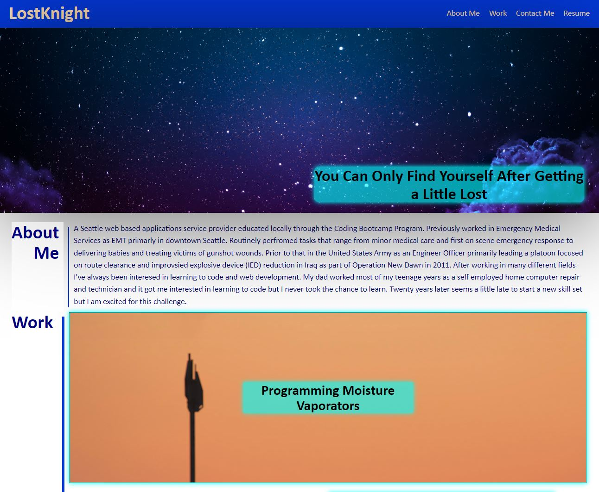
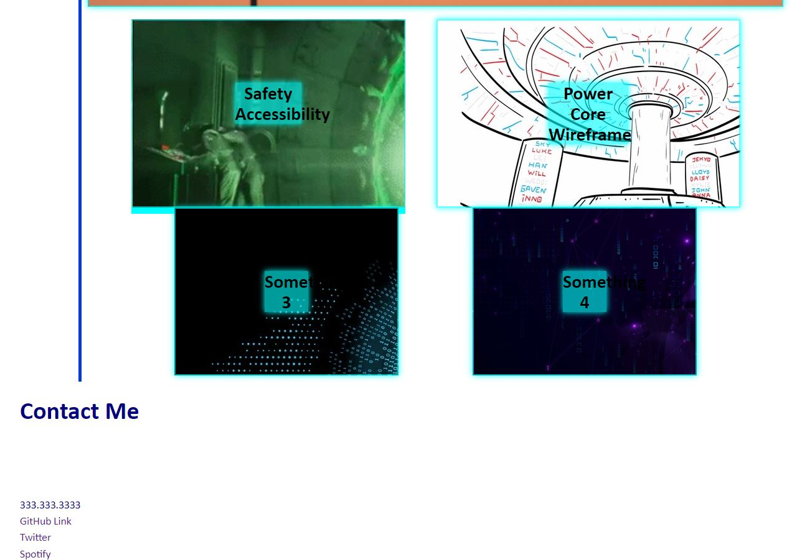

# los-knight-portfolio-page

A Portfolio Website Displaying the different work histories and personal history of Jonathan Knight 
Made by Jonathan Knight. Design from various sources in Class products and CSS Act28

Notes:

Navbar works, links works, collapses to columns at cell phone view

Hero image and text load and scale approiately

About Me and personal paragrapy text stret and scale approiately with

**** verticle line at About very thin not scaling with verticle line in Work, at an impasse. 

div for big-proj element scaling and sizing approiately 

broke my flex container cant figure out how to unfudge

image1 is broken not appearing on screen even though similarly coded container function in this regard at least

no alt text for images

fixed flexbow rows trying to align images and get content sized correctly

To Do List:
Fix flex box dimensions for lower 4 work items  xx
Align footer to main page x alternative solution
Get verticle line dimensions to format correctly oo needs further work

 [alt screen shot of page top half]
 [alt screen shot  of page bottom half]